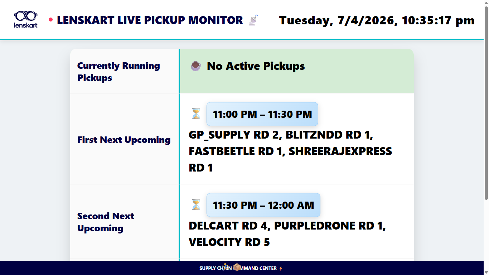

# 📡 Lenskart Live Pickup Monitor

A real-time, browser-based dashboard that shows **which courier pickups are currently running** and **what's coming up next** — built for Lenskart's Supply Chain Command Center.



---

## ✨ Features

| Feature | Detail |
|---|---|
| 🔴 Live clock | IST locale, updates every second |
| 🚨 Running pickups | Highlighted row with countdown timer & progress bar |
| ⏳ Upcoming slots | Next 3 upcoming pickup windows |
| ⚡ Flash + shake | Visual alert whenever the active pickup changes |
| 🏃 Footer runner | Animated emoji for that supply-chain energy |
| 📱 Responsive | Works on mobile & tablet |
| ♿ Accessible | `aria-live` regions for screen readers |

---

## 🗂 Project Structure

```
lenskart-pickup-monitor/
├── index.html                 # HTML shell — no inline JS or CSS
├── style.css                  # All styles
├── script.js                  # All application logic
├── data/
│   └── pickups.json           # ← Edit schedules HERE
├── assets/
│   └── lenskart-logo.png      # Local logo (CDN fallback built-in)
├── .github/
│   └── workflows/
│       └── deploy.yml         # Auto-deploys to GitHub Pages on push
├── .gitignore
├── CHANGELOG.md
└── README.md
```

---

## 🚀 Getting Started

### Option 1 — Open locally

```bash
# Clone the repo
git clone https://github.com/<your-username>/lenskart-pickup-monitor.git
cd lenskart-pickup-monitor

# Open directly in browser
open index.html       # macOS
xdg-open index.html   # Linux
start index.html      # Windows
```

> **Note:** Fetching `data/pickups.json` requires a local server (browsers block
> `fetch()` over `file://`).  Use any of these:
>
> ```bash
> # Python 3
> python3 -m http.server 8080
>
> # Node.js (npx)
> npx serve .
>
> # VS Code — install "Live Server" extension, then right-click index.html → Open with Live Server
> ```
>
> Then visit `http://localhost:8080`.

### Option 2 — GitHub Pages (recommended)

1. Push this repo to GitHub.
2. Go to **Settings → Pages → Source → GitHub Actions**.
3. The `deploy.yml` workflow deploys automatically on every push to `main`.
4. Your dashboard will be live at:
   ```
   https://<your-username>.github.io/lenskart-pickup-monitor/
   ```

---

## 📝 Updating the Pickup Schedule

All pickup times live in **`data/pickups.json`**. Each entry is:

```json
{
  "name":  "BLUEDART RD 1&2",
  "start": "02:00 AM",
  "end":   "02:30 AM"
}
```

**Rules:**
- Times must be in `hh:mm AM/PM` format (12-hour).
- Midnight-crossing windows like `11:30 PM – 12:00 AM` are handled automatically.
- Pickups sharing the same `start`/`end` window are grouped on the same row.
- After editing, commit and push — GitHub Pages redeploys within ~30 seconds.

---

## 🛠 How It Works

```
DOMContentLoaded
    └─ init()
          ├─ fetch("data/pickups.json")   load schedule
          └─ setInterval(update, 1000)    tick every second
                ├─ classify each pickup as running or future
                ├─ render running row  (countdown, progress bar)
                └─ render next 3 upcoming slots
```

Key functions in `script.js`:

| Function | Purpose |
|---|---|
| `toMin(t)` | `"02:30 AM"` → `150` (minutes since midnight) |
| `normalizeFuture(s, now)` | Adds 1440 to past start times so sort wraps correctly past midnight |
| `buildSlotMap(arr)` | Groups pickups by time window, returns sorted slot list |
| `update()` | Main render function, called every 1 second |

---

## 🌐 Browser Support

| Browser | Supported |
|---|---|
| Chrome / Edge 90+ | ✅ |
| Firefox 88+ | ✅ |
| Safari 14+ | ✅ |
| IE 11 | ❌ |

---

## 📄 License

Internal tool — Lenskart Supply Chain. Not for public distribution.
